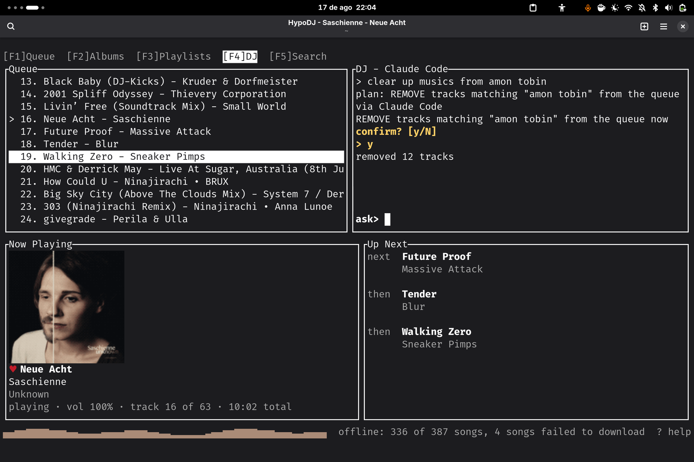
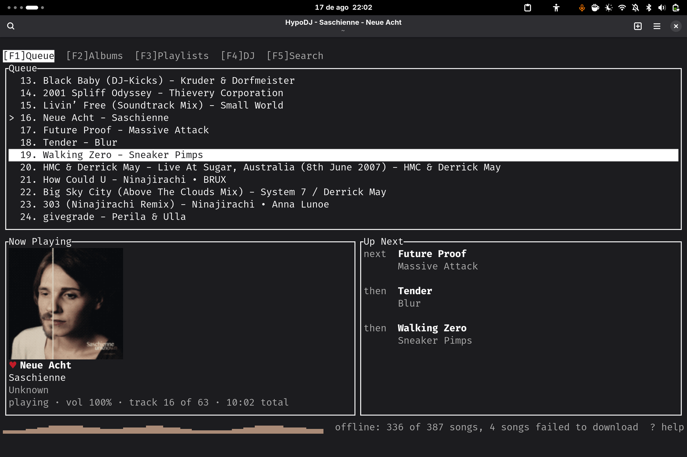

# hypodj - The DJ Underneath

A single Rust daemon that speaks the **MPD text protocol** to clients (ncmpcpp,
mpc, its own tools) and is itself an **OpenSubsonic client + mpv audio player**.
It replaced a mopidy + mopidy-subidy Python stack in one process: MPD commands in,
OpenSubsonic REST (browse / search / star / scrobble) and mpv-streamed audio out.

The name is from the Roman **hypocaust** (*hypo-* "beneath" + *kaustos* "burnt") -
the furnace under the bath, tended out of sight. hypodj is the DJ underneath: it
does the real work below while your client lounges in the warm room.

```
MPD client ──MPD text/TCP──▶ hypodj daemon ──OpenSubsonic REST──▶ Navidrome
(ncmpcpp, dj, dj-gui)             │                               (or any
                                  ▼                                OpenSubsonic
                             libmpv audio                          server)
```



*HypoDJ (`dj-gui`), the DJ View: the queue beside the natural-language DJ, with the now-playing card, up-next, and a live level meter.*



*The Queue View: the playing row marked, a favorited now-playing card with dithered cover art, up-next, the level meter, and the offline mirror reporting how much of the queue is on disk.*

## Ethos

Driving music should be human-native and **natural-language-first**: say what you
want in plain words ("play something calmer", "fade out in 20 minutes") and the
server handles the complexity. Natural language is translated server-side into a
validated plan and echoed back before it arms - never a surprise. Playback is
**startle-safe**: pause, resume, and skip fade instead of cutting, and volume
moves like a physical fader, not a step function.

## Clients

### HypoDJ (`dj-gui`) - the flagship

A ratatui terminal jukebox, pure MPD/TCP (no libmpv), event-driven via the
daemon's idle-push socket with worker-thread IO so the UI never blocks on network.

- Now-playing card with dithered album-art cover, up-next preview, and a physical
  volume fader
- Five screens (`F1`-`F5`): Queue / Albums / Playlists / DJ / Search - the DJ
  screen is a natural-language Claude Code DJ pane beside the queue (shown above)
- Vim-like navigation: `j`/`k`, `g`/`G`, scrolloff; `Shift`+`P` jumps the Queue
  cursor to the currently-playing song
- `r` starts an endless radio from the row under the cursor - a song, an album, an
  artist, anywhere including the search hits - and the queue keeps refilling itself
- `s` stars the row under the cursor; `Ctrl`+`s` marks what is ON AIR - which on a
  stream also keeps its audio (see the tape below). The reply is one sentence and
  it always says what happened, including why no audio was kept when none was
- `t` opens the read-back: your marks, oldest first, each with the segment it kept,
  how long it is, how honestly it was cut, and the directory it is in. `:heard keep
  <n>` pins one against the sweep
- `/` incremental search with `n`/`N` match cycling and matched-substring highlight
- `:` command line - verbs plus natural language with echo-before-arm confirm
- Physical-potentiometer volume knob: perceptual dB detents, off-click pause
- Queue markers on albums (fully / partially enqueued) and songs

### `dj` - the CLI

Pure MPD/TCP, no libmpv. Bare `dj` prints a now-playing card; `dj next`,
`dj pause`, `dj vol 40` are quick verbs; anything else is natural language with
the same echo-before-arm confirm: `dj "play something calmer"`. `dj radio` starts
the endless radio from whatever is playing (`dj radio random` from cold, `dj radio
off` to stop). `dj mark` is the press; `dj heard` reads the ledger back with each
marked row's tape segment beside it, and `dj heard keep <n>` / `dj heard drop <n>`
pin and release one.

Any stock MPD client (ncmpcpp, mpc) also works unchanged against the daemon.

## What the daemon does

| Area | What |
| --- | --- |
| MPD server | Hand-rolled TCP server: full ncmpcpp command surface, `idle` push, binary `albumart`/`readpicture`, `sticker` ratings, `find`/`search`, playlists |
| Library | OpenSubsonic browse/search3, smart album lists, genres, first-class favorites (songs / albums / artists), scrobbling, TTL+LRU listing cache |
| Playback | libmpv actor; startle-safe fades on pause/resume/skip; graduated + humanized absolute volume; sleep / wind-down / wake; smooth restart |
| Endless radio | `radio` starts a never-ending radio from a thing (`radio`, `radio random`, `radio song/<id>`, `radio album/<id>`, `radio artist/<id>`): it plays what you pointed at - bare `radio` picks the deck up where it stands (resumes a paused one, starts a stopped one, never restarts what is already playing) - prefetches one batch of similar library tracks behind it, and hands the end-of-queue edge to the continuation walk, which re-seeds from what just played and so keeps moving through your own library. `radio on` arms the walk without touching the queue; `radio off` disarms and restores the configured continuation mode |
| Keeping what you heard | `mark` names the moment, stars it when you own it, writes one ledger row - and KEEPS THE SOUND. mpv is already holding the whole past of the stream in RAM, so a press dumps the last few minutes to `~/.local/state/hypodj/tape/` in about 6 ms with zero network. Read it back with `dj heard`; pin one with `heard keep <n>` |
| Intent | Deterministic capability core + typed Plan IR; the NL front-end (rules-first, optional local model) only ever emits a validated plan |
| Desktop | MPRIS, so GNOME media controls work |

### The tape, and what a filename is allowed to claim

There is no separate capture verb. One press does everything, because a two-key
choice in the moment is exactly the cleverness that goes wrong.

A press dumps a generous window FIRST and reasons afterwards, on a local file -
the RAM cache is destroyed by every skip and station change, and it was measured
returning `"error":"success"` while writing a zero-byte file. So the dump is
proved by evidence at two layers (bytes on disk, then an `ffprobe` duration) and
only a file that clears both ever gets a name.

Two filename shapes, and the shape IS the claim:

- `20260805-2317-nts-2-w312s` - on this station, around this minute, 312 seconds
  that certainly contain what you heard and also contain other things. No artist,
  no title, ever - not while an ICY line is standing, not after a recognition
  names it. A Shazam offset narrows a search; it never authorises a cut, so it
  never earns a name.
- A track-shaped name is earned only by a position-stamped ICY start edge, and it
  is currently GATED OFF pending one measurement (does the ICY flip land at the
  playhead or at the read position?). Until that is measured the cut still trims -
  the file really is narrower - but the name stays a window.

If the press starred a copy you already own, the rip is deleted: you have the
studio master, and a radio rip of it is a worse copy with worse provenance. So the
tape fills up with exactly the case nothing else can solve.

The tape is a ROLLING CACHE, not an archive. `[tape].max_bytes` (2 GiB by default,
about ten weeks of five-presses-an-evening) evicts oldest-first, skipping anything
you flagged `heard keep`. A ledger row outliving its audio is designed for, and
says so when you read it back.

```toml
[tape]
enable = true         # substrate; the safety bound is max_bytes, not this
# dir = "..."         # defaults to <state_dir>/tape, a SIBLING of store/ and heard/
max_bytes = 2147483648
back_secs = 300       # how much past a press asks for
max_secs = 1200       # hard span cap per dump
```

## Install and run (Nix)

```
nix run github:FamiliarTools/hypodj#dj       # the CLI (default app)
nix run github:FamiliarTools/hypodj#dj-gui   # HypoDJ, the TUI
```

The flake ships `packages.hypodj` (the daemon, libmpv wrapped),
`packages.hypodj-clients` (`dj` + `dj-gui`), and one shared `services.hypodj`
module for both NixOS and Home-Manager:

```nix
{
  inputs.hypodj.url = "github:FamiliarTools/hypodj";

  imports = [ hypodj.nixosModules.default ];   # or homeManagerModules.default

  services.hypodj = {
    enable = true;
    server.url = "https://navidrome.example.com";
    server.username = "you";
    server.passwordFile = config.sops.secrets."hypodj/password".path;
  };
}
```

The password is read at service start into a `0600` runtime config - never the
Nix store (`passwordCommand` is the alternative to `passwordFile`). The service
runs headless (`audio = "null"`) by default; set `audio = "device"` when hypodj
should own the speakers. Then point any client at `mpd.bind`
(e.g. `ncmpcpp -h 127.0.0.1 -p 6601`, the default; 6600 is reserved for mopidy,
so use it only if you set `mpd.bind = "127.0.0.1:6600"`).

## Layout

| Crate | What |
| --- | --- |
| `crates/hypodj-core` | The library: config, model, subsonic, player, MPD handler, plan/executor, fade, MPRIS |
| `crates/hypodj-daemon` | `hypodj` daemon binary + `probe`/`play_probe` live provers |
| `crates/hypodj-nl` | Natural language to validated Plan IR (rules + optional local model) |
| `crates/hypodj-client` | Shared client lib (MPD connection, `nl` handshake, routing) |
| `crates/hypodj-cli` | `dj` |
| `crates/hypodj-tui` | `dj-gui` (product name HypoDJ) |

Building, testing, and deploying are covered in [CLAUDE.md](CLAUDE.md).
